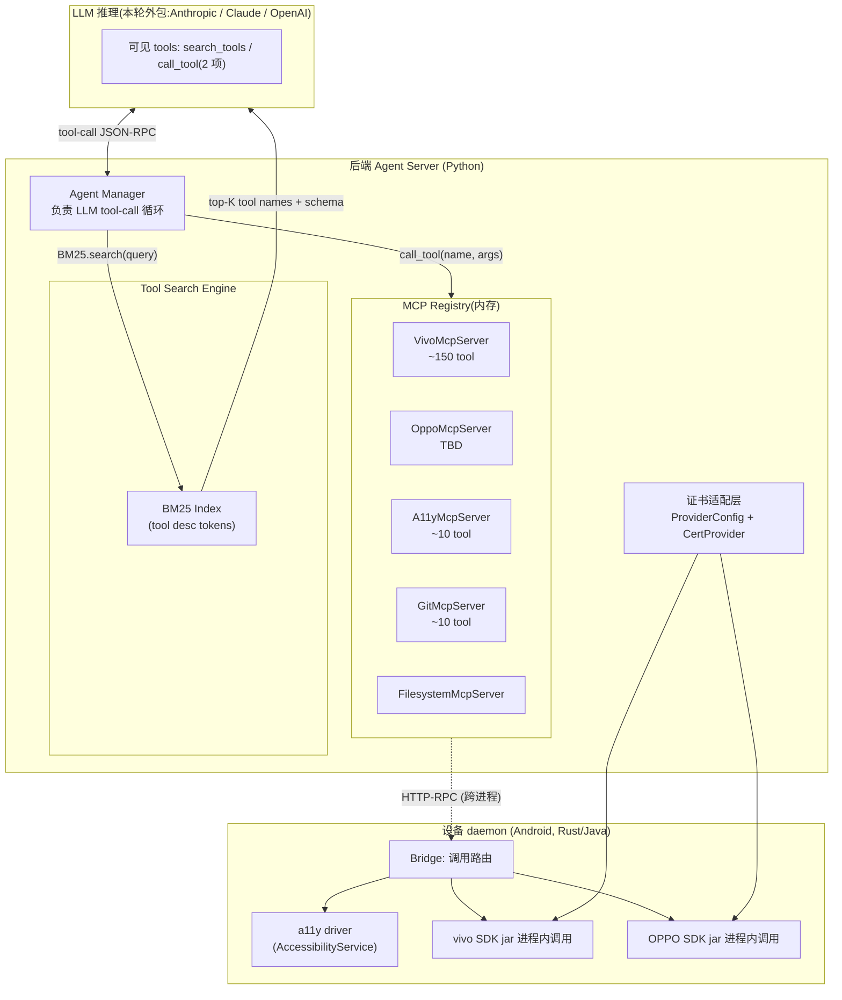
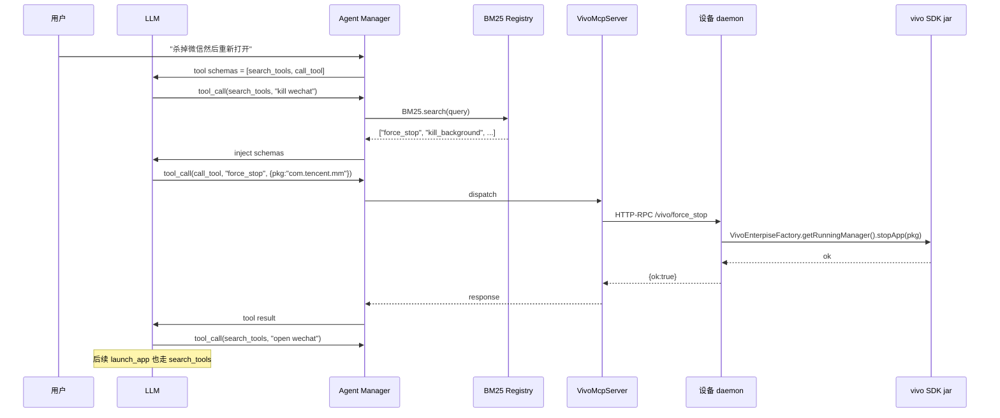

# Plan: SDK-as-MCP General Agent Architecture

> 通用 Agent 平台:多厂商 SDK 接入 + MCP 协议 + BM25 工具检索 + a11y 兜底
>
> 日期: 2026-07-29 · 状态: 方案设计 · 关联: [2026-07-22 capability architecture](sdk/vivo_sdk.md)

## 1. 背景与转折

项目原架构([2026-07-09 全闭环](docs/superpowers/specs/2026-07-09-full-loop-and-skill-cache-design.md))是**直连云端决策**:`云端 LLM → action JSON → 端侧 a11y`。SDK 的角色([2026-07-22 设备能力架构](docs/superpowers/specs/2026-07-22-device-capability-architecture-design.md))仅是**端侧**的可选 Provider 插件。

**当前重新定义**:云端不再直接是 LLM 决策层,而是**通用 Agent 编排器**:
- 一个**工具生态**由多个 MCP server 提供(vivo / OPPO / filesystem / git / docker / ... )
- LLM 只看到**两个根工具**:`search_tools(query)` 和 `call_tool(name, args)`
- BM25 实时召回,降 token 消耗,不再是当前 prompt 写死 op 名

**反转后**:
- vivo/OPPO SDK 不是直接做 op,而是**打包成 MCP server tool** 暴露出去
- 设备端 daemon 是**透明的 SDK + a11y 执行机**,后端看不到 a11y 概念
- 证书形式差异化由 **Provider Adapter 层** 抽象

## 2. 设计目标

### 2.1 核心原则
1. **LLM 永远见不到 Provider 概念**:它只知道 tool 名字 + 参数 schema
2. **MCP 是接入协议,不是协议的实现**:tool 描述必须标准 MCP tool schema (openapi-like)
3. **BM25 是 LLM 工具发现通道**:search_tools / call_tool 二元组,支持数千 tool 不爆 prompt
4. **SDK 缺能力时,自动回落到 a11y**(daemon 提供 a11y MCP server,SDK adapter 缺位则路由到该 server)
5. **证书形式抽象**:Adapter SPI 接受任意 `ProviderConfig` 子类型,运行时决定如何调用

### 2.2 不在本轮范围
- vivo 证书申请流程 / X509 PKI 仓库(留作基础设施)
- 真机 SDK 集成测试(等 vivo 证书就位)
- LLM tool-call loop 编排(MCP Framework 现成,本轮用现成的)
- MCP 多传输协议(stdio/HTTP/SSE)选型(默认 stdio,适合进程内)

## 3. 核心决策记录 (DR)

| # | 决策 | 选项 | 理由 |
|---|---|---|---|
| DR-1 | MCP server 注册中心是后端 server 进程内的内存表 | vs 单独服务 | 简化部署;BM25 索引一次性,无需外部存储 |
| DR-2 | 工具以 MCP 标准 schema 暴露,Provider Adapter 才是 SDK 细节 | vs 透传 SDK 方法名 | LLM 上下文必须清爽,且未来支持非 SDK 工具源(file/git/docker) |
| DR-3 | search_tools 是稀疏 BM25,call_tool 路由到具体 server | vs Anthropic 自动全表 | 显式二段式,可控性强,适合服务端 agent 编排 |
| DR-4 | a11y 当兜底 MCP server,与厂商 SDK 平级 | vs a11y 是 SDK 的 proxy | 互斥分析见 §4.2,这样更内聚 |
| DR-5 | 设备 daemon 是单一进程(host:device-daemon),既跑厂商 SDK jar,也跑 a11y,注册多个本地 MCP server | vs daemon 拆多 | 接口在 OS 层天然合并,降复杂度 |
| DR-6 | BM25 索引构建时机:**预热 + 增量** | vs 纯查询时构建 | SDK 描述长,每次启动重算廉价,但 1200 tool 不预热会卡;索引常驻内存 |
| DR-7 | MCP server 之间用本地 in-process channel(daemon 内)+ HTTP RPC(跨设备) | vs 全部 stdio | in-process 0 开销,跨设备用 HTTP |
| DR-8 | 设备 daemon 通过 long-poll + capability 矩阵上报,云端按需下发 tool | vs 全量同步 | 1200 tool 全量太慢;后端 BM25 召回只下发"看起来相关"的一组 token 给 LLM |

## 4. 架构总览

### 4.1 抽象层次



### 4.2 a11y 与 SDK 的关系

**为什么 a11y 单独 MCP server**:
- vivo SDK 在 21 个 Manager 中**没有**输入注入(click / input / gesture)与 node tree 感知
- a11y 是**唯一**能做 UI 自动化的人(SDK 不会重造 AccessibilityService)
- SDK 是 a11y **做不了**的事(强杀 / 静默安装 / 锁定无障碍 / 设备管控)

```
┌──────────────────────────────────────┐
│ MCP Tool Space (LLM 看的)            │
├──────────────────────────────────────┤
│ VivoMcpServer:                       │
│   • force_stop(pkg)                  │
│   • install_silent(apk)              │
│   • lock_a11y()                      │
│   • reboot_device()                  │
│   • ...(~150 个 System 级)           │
│ A11yMcpServer:                       │
│   • tap_text(text, occurrence)       │
│   • input_at(nodeId, text)           │
│   • swipe(x1,y1,x2,y2)               │
│   • read_screen()                    │
│   • ...(~10 个 UI 自动化)            │
│ GitMcpServer:                        │
│   • git_status / git_diff / ...      │
└──────────────────────────────────────┘
```

**LLM 不感知 "这是 vivo SDK 还是 a11y",它只看到 tool 名 + schema**。
- `tap_text` → BM25 命中 → A11yMcpServer
- `force_stop` → BM25 命中 → VivoMcpServer (若 vivo SDK 已激活,否则报 cert_missing)

### 4.3 BM25 工具检索流程

```
[1] LLM 第一次推理: prompt = user_goal + [search_tools, call_tool]

[2] LLM 调 search_tools("force stop wechat")
   → BM25 index top-K=10
   → 反回 schema 列表(精简版,只 name + desc + arg hint)
   → LLM 注入临时 function schema 进 context

[3] LLM 调 call_tool("force_stop", {pkg: "com.tencent.mm"})
   → Registry 路由到对应 server
   → server 调 daemon → vivo SDK
   → JSON-RPC 响应回 LLM

[4] 任务终止 or LLM 续搜
```

**关键设计**:
- BM25 召回后只下发 **tool 名 + 一行 desc + 必要 arg 名**(避免重新灌入完整 JSON Schema)
- LLM 在临时工具列表中选 → 调 call_tool
- 若 LLM 召回工具但缺参数 → 自动调 `inspect_tool(name)` 拿完整 schema(本轮不实装,留 ToServer.getToolSpec)

### 4.4 设备 daemon 角色

`host:device-daemon` 是新长驻进程,职责:
1. **启动各类 Provider Driver**: vivo SDK adapter / OPPO SDK adapter / a11y driver
2. **接受后端 HTTP-RPC 调用**:`/mcp/tools/{name}` 路由到 driver,带设备上下文(deviceId/capabilities)
3. **能力矩阵首帧上报**(沿用 [DR-2](docs/superpowers/specs/2026-07-22-device-capability-architecture-design.md#9-决策记录dr)):`POST /api/devices/{id}/hello`,但内容是 **driver 列表**(vivo/a11y/git?)而不是 SDK capability 名
4. **BM25 跨设备协调**:后端只为该设备构造**该设备能力的**工具索引(没有 force_stop 能力的设备就不入索引)

### 4.5 证书适配层

新概念 `ProviderConfig`:
```python
@dataclass
class ProviderConfig:
    """证书无关的统一 Provider 配置抽象"""
    driver_type: Literal["vivo", "oppo", "xiaomi", "a11y", "filesystem"]
    device_id: str
    # 其余字段按 driver_type 走不同子 schema
    cert: CertProvider | None  # 抽象的证书对象,内部延迟到具体 driver

class CertProvider(ABC):
    async def fingerprint(self) -> str  # 设备指纹,用于后端路由
    async def sign(self, payload: bytes) -> bytes  # 调 SDK 时签名
```

各厂商证书后端拿不到 → 必须**设备侧存 + 后端代理调用**:
```
后端: call_tool("force_stop", {pkg})
  ↓ (HTTP-RPC)
daemon: VivoDriver.exec(force_stop, params)
  ↓
vivo SDK jar 调 vivo 后台接口(带设备侧存证书)
```

**采用每设备独立凭证**:
- 设备 daemon 启动时读本机凭证文件(出厂预置 或 运行时注册)
- 后端 server 不存证书,**只存**(device_id → alive driver 列表)的路由表
- 安全性:**daemon 仅暴露 route,不暴露 SDK API surface**

## 5. 整体数据流(一次完整 tool 调用)



## 6. 模块拆分与依赖

### 6.1 后端 (Python)

| 路径 | 职责 | 关键依赖 |
|---|---|---|
| `server/app/agent/manager.py` | LLM 编排,tool-call 循环 | mcp 库, anthropic-sdk |
| `server/app/mcp/registry.py` | MCP server 内存表 | rank_bm25 |
| `server/app/mcp/index.py` | BM25 索引构建 + 增量 | rank_bm25 |
| `server/app/mcp/protocol.py` | JSON-RPC 兼容的 MCP 协议子集 | json |
| `server/app/mcp/router.py` | call_tool 路由到本地 server / HTTP RPC 转发 | aiohttp |
| `server/app/agent/cert.py` | CertProvider 抽象 | — |
| `server/app/api/devices.py` | 设备 hello 上报 + capability 探测 | FastAPI |

### 6.2 设备 daemon (Android, Java/Rust)

| 路径 | 职责 | 关键依赖 |
|---|---|---|
| `agent-daemon/main.py`(或 `MainService.kt`) | HTTP server / 命令分发 | okhttp / actix |
| `agent-daemon/drivers/A11yDriver.java` | 包 a11y driver,转发 SDK 调用到 AccessibilityService | android.accessibilityservice API |
| `agent-daemon/drivers/VivoDriver.java` | 包 vivo SDK Manager 调用 | vivo SDK jar + 设备侧凭证 |
| `agent-daemon/drivers/McpServer.java` | 把 driver 暴露为 MCP tool,吐 JSON-RPC | — |

### 6.3 LLM 调用流程

```
AgentManager.run(user_msg)
  1. 拿 device capability (从入参 or 上游 hello)
  2. 构造 BM25 index (按该设备 alive drivers)
  3. 调 LLM: messages = [user_msg, system="you have only search_tools and call_tool"]
  4. LLM 返回 tool_call → 分派:
       search_tools → BM25.search → 返回精简 schema 列表(LLM 下一轮能看到)
       call_tool    → Registry.route → (本地 OR HTTP RPC)
  5. tool_result → 喂回 LLM
  6. 循环直到 LLM 不再调 tool OR max_steps
```

## 7. 阶段化实装计划

### Phase 1 (骨架): MCP + BM25 + 单设备 a11y Provider
- 后端:实现 `server/app/mcp/{registry,index,protocol,router}.py`
- 后端:实现 `server/app/agent/{manager.py,cert.py}` 不接 LLM,MiniMock LLM
- daemon:实装 a11y driver + 单 MCP server (`A11yMcpServer`)
- 单测:BM25 召回归位,call_tool 路由正确
- ✅ Exit Criterion: `AgentManager.run("点第3个 tab")` 真机/模拟可执行

### Phase 2: vivo SDK Provider 接入
- 后端:`server/app/mcp/providers/vivo/` 装 `VivoMcpServer`,通过 HTTP RPC 调 daemon
- daemon:`VivoDriver` + 加载 vivo SDK jar + 证书读取
- 单测:模拟 daemon 进程,call_tool("force_stop", ...) 走通
- ✅ Exit Criterion: 真 vivo 设备 + vivo 证书可走 force_stop 通路

### Phase 3: 通用 Adapter SPI
- 后端:`server/app/mcp/provider_spi.py` — Provider 注册协议
- daemon:driver 协议相同,加通用 driver 调度
- 单测:mock 自定义 driver 可注册并被 BM25 索引到
- ✅ Exit Criterion: 加一个新 driver 不改 MCP/BM25/registry

### Phase 4: 多设备 + 设备路由
- 后端:device_id 路由表,按设备 capability 裁 BM25 索引
- daemon:多设备 daemon 进程模型(每台设备一个 daemon)
- 单测:多设备并发,call_tool 不串号
- ✅ Exit Criterion: 两台设备并发,search_tools 召回互不污染

### Phase 5: LLM tool-call 闭环
- 接现成 MCP Framework / Anthropic tool use,验证闭环
- 单测:e2e LLM 工具调用
- ✅ Exit Criterion: 真 LLM + 真 daemon + 真 SDK 跑通"kill wechat"场景

## 8. 关键文件与现有代码关系

| 现有路径 | 关系 |
|---|---|
| `server/app/decision/engine.py` | **Phase 5 替换**:旧 engine 是 LLM 直调,新 manager 是 MCP 编排 |
| `server/app/protocol/models.py` | 保留:仍是端↔后端通讯协议,但 action.op 不再写死 SDK API,MCP 层抽象 |
| `server/app/task/handlers.py` | 保留:task 状态机 / 上行识别继续使用 |
| `android/app/src/main/java/.../PhoneAgentService.kt` | 保留前端兼容 layer, **Phase 1+ 后** 可改为轻 RPC 客户端(由 daemon 替代) |
| `docs/superpowers/specs/2026-07-22-device-capability-architecture-design.md` | 多个 DR 与本设计兼容(Provider SPI / 端侧能力探测),但**抽象粒度改变**:SDK 不再是 op,SDK 全量打包为 MCP server |

## 9. 风险与边界

| 风险 | 影响 | 缓解 |
|---|---|---|
| BM25 召回不准 | LLM 拿到不相关 tool | 限定 top-K=10,允许 LLM 二次 search (search_tools 多次调) |
| 1200+ tool 完全发送 | prompt 爆 | 本设计杜绝 — LLM 永远只看到 search_tools + call_tool |
| vivo SDK 仅 vivo 设备可用 | 跨厂商碎片化 | Provider SPI 透明,phase 3 后可加 OPPO/小米 |
| 证书过期 / 设备 daemon 失联 | tool 调用失败 | Registry 缓存 device health,call_tool 超时沿用 TaskState.Failed 机制 |
| call_tool 路由回环 (daemon → backend → daemon) | 性能消耗 | daemon 直连 device-local,不需回后端,只有"跨设备" 才走 HTTP-RPC |

## 10. 验收标准

- **`docs/superpowers/specs/2026-07-29-sdk-as-mcp-architecture.md`**:本轮设计产物
- **`docs/superpowers/plans/2026-07-29-sdk-as-mcp-phase1.md`**:Phase 1 实装计划
- 阶段 Exit Criterion 见 §7
- **不动代码** 本轮,等用户评审通过再启动 Phase 1
